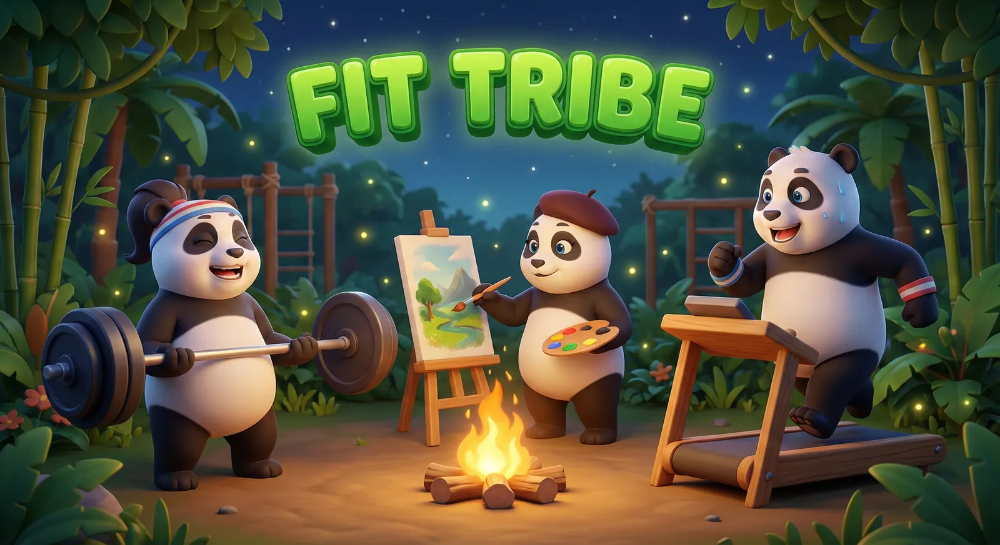

# FitTribe 🐼

**[Live Demo](https://tribeworkout.netlify.app/)** | **[Launch Info](https://www.producthunt.com/products/fittribe)**



A **Holistic Wellbeing Community** wrapped in a cute, panda-themed jungle. FitTribe isn't just about the gym—it's a digital campfire for close-knit groups to track fitness, creativity, and mental health together.

Built with **React 19**, **Supabase**, and **Google Gemini AI**.

---

## 🌟 Why FitTribe?

Most apps separate your "fitness" (lifting, running) from your "wellness" (painting, cooking, meditating). FitTribe brings them together.

*   **Wholesome Aesthetic:** A cozy, panda-themed jungle interface that replaces "gym bro" energy with welcoming vibes.
*   **Holistic Activity Tracking:** Log everything from Strength Training and Swimming to "Wellbeing Actions" like Cooking and Painting.
*   **Inclusive Progress:** A fair system that rewards consistency across all activities, allowing diverse users to grow together without competition.
*   **Sage Panda AI:** An intelligent agent that generates personalized Weekly Plans and Diet Plans based on your unique goals and feedback.
*   **Supportive Economy:** Earn growth points to unlock badges, send virtual gifts to tribe members, and buy cozy new themes.
*   **Adaptive Guidance:** Strength logs come with post-workout reflection, allowing the AI to gently adjust future intensity based on how you felt.
*   **Tribe Dynamics:** Contribute to global "Team Streaks" and "Tribe Goals" where every member's effort counts.
*   **Offline-First:** Built as a PWA with optimistic UI patterns. Your logs save instantly and sync when you're back online.

---

## 🛠️ Tech Stack

*   **Frontend:** React 19, Tailwind CSS, Lucide React, Framer Motion (animations).
*   **Backend/DB:** Supabase (PostgreSQL + Auth + Realtime + RLS).
*   **AI:** Google Gemini API (`gemini-flash-lite`).
*   **Build Tool:** Vite.
*   **PWA:** `vite-plugin-pwa` for robust offline capabilities.
*   **Hosting:** Netlify (Recommended for simple deployment).

---

## 📋 Setup Guide

### 1. Prerequisites
You need a [Supabase](https://supabase.com) project and a [Google Gemini API Key](https://ai.google.dev/).

### 2. Assets
Ensure `public/assets` contains your theme images (mascots, backgrounds) in WebP format.

### 3. Database
Run the `supabase_db.sql` script in your Supabase SQL Editor. This sets up:
*   Tables: `profiles`, `workout_logs`, `tribes`, `gamification_state`
*   Security: Row Level Security (RLS) policies for privacy.

### 4. Environment Variables
Create a `.env` file in the root directory. **DO NOT commit this file.**

```bash
VITE_SUPABASE_URL=your_supabase_project_url
VITE_SUPABASE_KEY=your_supabase_anon_key
VITE_API_KEY=your_gemini_api_key
```

### 5. Running Locally

```bash
npm install
npm run dev
```

---

## 🚀 Deployment

### Netlify
1.  Connect your repository to Netlify.
2.  Set the **Build Command** to `npm run build`.
3.  Set the **Publish Directory** to `dist`.
4.  Add your environment variables in **Site Settings > Build & Deploy > Environment**.
5.  Deploy!

---

## 🤝 Contributing

We welcome contributions! Whether it's a bug fix, new feature, or documentation improvement, we'd love to have you involved.

1.  **Fork** the repository.
2.  Create a new branch (`git checkout -b feature/AmazingFeature`).
3.  Commit your changes (`git commit -m 'Add some AmazingFeature'`).
4.  Push to the branch (`git push origin feature/AmazingFeature`).
5.  Open a **Pull Request**.

Please ensure your code follows the existing style and conventions.

---

## 💬 Support

If you have any questions, encounter issues, or have suggestions, please open an **Issue** in this repository. We're happy to help!

---

## 🛡️ License

Distributed under the MIT License. See `LICENSE` for more information.

